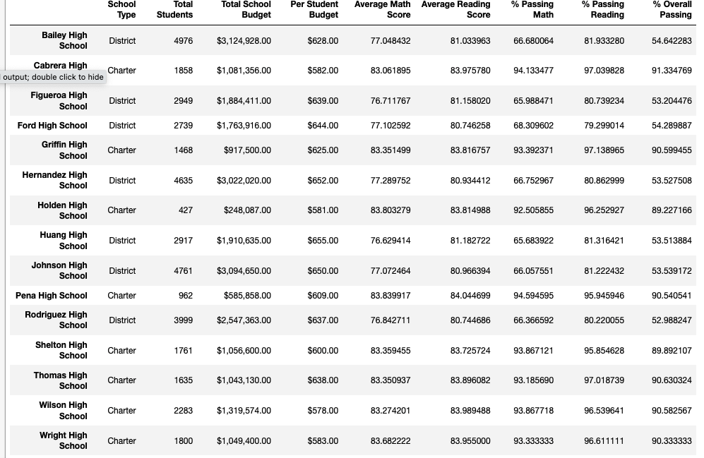
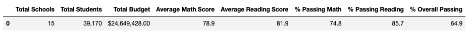
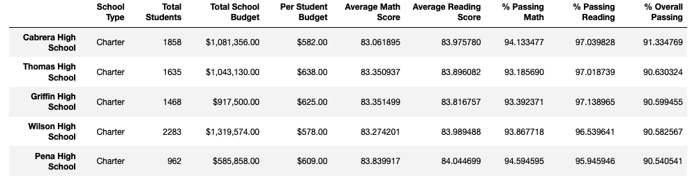
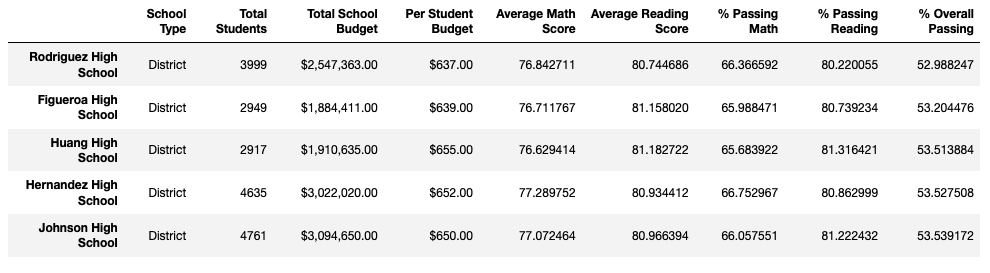
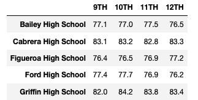
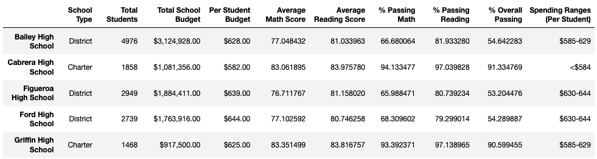
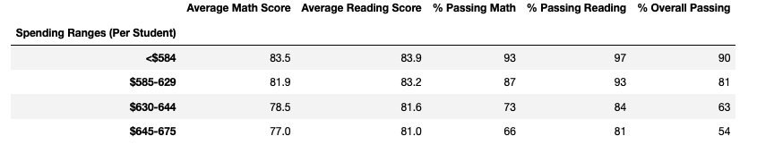
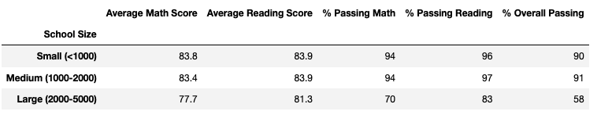
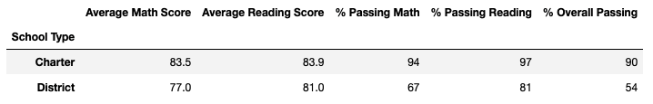

# School_District_Analysis

## Overview 

### Purpose

The school board has notified Maria and her supervisor that the students_complete.csv file shows evidence of academic dishonesty; specifically, reading and math grades for Thomas High School ninth graders appear to have been altered. Although the school board does not know the full extent of the academic dishonesty, they want to uphold state-testing standards and have turned to Maria for help. She has asked you to replace the math and reading scores for Thomas High School with NaNs while keeping the rest of the data intact. Once you’ve replaced the math and reading scores, Maria would like you to repeat the school district analysis that you did in this module and write up a report to describe how these changes affected the overall analysis.

## Results

**Summary**

Not sure if i did something wrong (used a wrong DataFrame), but i was assuming i would get diffrent results after removing Thomas High School 9th grades to naNs, but had the exact results
